# 🧠 Agentic AI Finance Agent

> Multi-agent assistant that fuses **live market data** with **web-scraped news** — powered by [Agno](https://pypi.org/project/agno/).

---

## ✨ Features

| Capability            | Details                                                                                                   |
|-----------------------|------------------------------------------------------------------------------------------------------------|
| **Web Search Agent**  | Queries DuckDuckGo, returns concise answers with clickable citations.                                     |
| **Finance Agent**     | Pulls live quotes, fundamentals, analyst calls, and company news from Yahoo Finance.                      |
| **Coordinator Agent** | Orchestrates both specialised agents for richer multi-modal answers.                                      |
| **Streaming**         | Responses appear token-by-token for snappy UX.                                                            |
| **Tabular Output**    | Numerical data is formatted in Markdown tables out-of-the-box.                                            |
| **Persistent Memory** | Optional SQLite storage remembers previous chats.                                                         |
| **FastAPI Playground**| Beautiful web UI for interactive exploration.                                                             |

---

## 🏗️ Architecture

```mermaid
flowchart LR
    A([User Prompt]) --> C{{Multimodal<br/>Coordinator Agent}}
    C --|delegates|--> WS[Web Search Agent]
    C --|delegates|--> FA[Finance Agent]
    WS -->|DuckDuckGo API| DDG[🌐 Web]
    FA -->|Yahoo Finance| YF[📈 Market Data]
    subgraph Tools
        DDG
        YF
    end
    WS & FA --> C
    C --|Stream<br/>Markdown|--> U([User])
``` 


---

## ⚡ Quick Start

```
# 1) Clone the repo
git clone https://github.com/Dumidu1212/agentic_ai_financial_agent.git
cd agentic-ai-finance-agent

# 2) Create & activate a virtual environment
conda create -p venv python==3.13
conda activate venv/             # PowerShell: .venv\Scripts\Activate.ps1

# 3) Install dependencies
python -m pip install --upgrade pip
pip install -r requirements.txt

# 4) Configure secrets
cp .env.example .env
$EDITOR .env                       # paste your GROQ_API_KEY here

# 5) Run a sample query
python scripts/quick_demo.py
